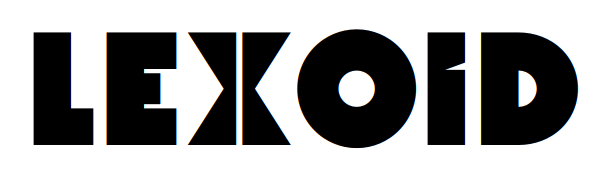

<div align="center">



</div>

[](https://github.com/oidlabs-com/Lexoid/blob/main/LICENSE)
[](https://pypi.org/project/lexoid/)
[](https://oidlabs-com.github.io/Lexoid/)

Lexoid is an efficient document parsing library that supports both LLM-based and non-LLM-based (static) PDF document parsing.

[Documentation](https://oidlabs-com.github.io/Lexoid/)

## Motivation:

- Use the multi-modal advancement of LLMs
- Enable convenience for users
- Collaborate with a permissive license

## Installation

### Installing with pip

```
pip install lexoid
```

To use LLM-based parsing, define the following environment variables or create a `.env` file with the following definitions

```
OPENAI_API_KEY=""
GOOGLE_API_KEY=""
# 可改成 deepseek-v4-flash 或 MiniMax-M2.7
DEFAULT_LLM="gemini-3.5-flash"
DEEPSEEK_API_KEY=""
DEEPSEEK_BASE_URL="https://api.deepseek.com"
MINIMAX_API_KEY=""
# 中国大陆用户可使用 https://api.minimaxi.com/v1
MINIMAX_BASE_URL="https://api.minimax.io/v1"
```

Select a configured provider either by model-name inference or explicitly:

```bash
lexoid parse -i document.pdf -p LLM_PARSE --model deepseek-v4-flash
lexoid parse -i document.pdf -p LLM_PARSE --api minimax --model MiniMax-M2.7
```

DeepSeek V4 and MiniMax M2 currently expose text-only chat models. Their keys
and endpoints can be selected by Lexoid, but direct PDF/image parsing still
requires a vision-capable model/provider.

For local inference with Ollama, no API key is required. Install Ollama, pull the target model, and keep the local server running:

```bash
ollama pull gemma4
export OLLAMA_BASE_URL=127.0.0.1:11434
ollama list
ollama serve

# docker
Reference: https://docs.ollama.com/docker#run-model-locally
CPU example (will most likely be slower; remember to adjust `OLLAMA_TIMEOUT` as needed)
- docker run -d -v ollama:/root/.ollama -p 11434:11434 -e OLLAMA_BASE_URL=0.0.0.0 -e OLLAMA_TIMEOUT=240 --name ollama ollama/ollama
- docker exec -it ollama ollama pull gemma4:latest
```

Optionally, to use `Playwright` for retrieving web content (instead of the `requests` library):

```
playwright install --with-deps --only-shell chromium
```

### Building `.whl` from source

> [!NOTE]
> Installing the package from within the virtual environment could cause unexpected behavior,
> as Lexoid creates and activates its own environment in order to build the wheel.

```
make build
```

### Creating a local installation

To install dependencies:

```
make install
```

or, to install with dev-dependencies:

```
make dev
```

To activate virtual environment:

```
source .venv/bin/activate
```

## Usage


Here's a quick example to parse documents using Lexoid:

```python
from lexoid.api import parse
from lexoid.api import ParserType

parsed_md = parse("https://www.justice.gov/eoir/immigration-law-advisor", parser_type="AUTO")["raw"]
# or
pdf_path = "path/to/immigration-law-advisor.pdf"
parsed_md = parse(pdf_path, parser_type="LLM_PARSE")["raw"]
# or
pdf_path = "path/to/immigration-law-advisor.pdf"
parsed_md = parse(pdf_path, parser_type="STATIC_PARSE")["raw"]

print(parsed_md)
```

### Parameters

- path (str): The file path or URL.
- parser_type (str, optional): The type of parser to use ("LLM_PARSE" or "STATIC_PARSE"). Defaults to "AUTO".
- pages_per_split (int, optional): Number of pages per split for chunking. Defaults to 4.
- max_threads (int, optional): Maximum number of threads for parallel processing. Defaults to 4.
- \*\*kwargs: Additional arguments for the parser.

## Command Line Usage

Lexoid provides a command-line interface for document parsing without writing Python code.

### Installation

The CLI is automatically available after installing Lexoid:

```bash
pip install lexoid
lexoid --help
```

Alternatively, use with Python module syntax:

```bash
python -m lexoid --help
```

### Parse Documents

Convert documents to markdown or JSON:

```bash
# Parse to stdout (default markdown)
lexoid parse --input document.pdf

# Save to file
lexoid parse --input document.pdf --output output.md

# Output as JSON (includes metadata, segments, token usage)
lexoid parse --input document.pdf --format json --output result.json

# Use specific parser (STATIC_PARSE, LLM_PARSE, or AUTO)
lexoid parse --input document.pdf --parser-type STATIC_PARSE

# Use specific LLM model
lexoid parse --input document.pdf --model gpt-4o

# Enable verbose logging
lexoid parse --input document.pdf --verbose

# Print one progress log as soon as each page completes
lexoid parse --input document.pdf --verbose --pages-per-split 1
```

### Extract Structured Data with JSON Schema

Extract data conforming to a JSON schema:

```bash
# Inline schema
lexoid schema \
  --input document.pdf \
  --schema '{"type": "object", "properties": {"title": {"type": "string"}}}' \
  --output result.json

# Schema from file
lexoid schema \
  --input document.pdf \
  --schema schema.json \
  --output result.json

# Specify LLM provider
lexoid schema \
  --input document.pdf \
  --schema schema.json \
  --api openai \
  --model gpt-4o
```

### Convert to LaTeX

Convert documents to LaTeX format:

```bash
# Convert to stdout
lexoid latex --input document.pdf

# Save to file
lexoid latex --input document.pdf --output output.tex

# Use specific model
lexoid latex --input document.pdf --model gpt-4o
```

The LaTeX command reports progress after each page completes, for example:
``Progress: page 3/10 completed``.

When ``--output`` is used, every completed page is written atomically and
tagged with a LaTeX checkpoint comment. If conversion stops after page 5,
resume without overwriting those pages:

```bash
lexoid latex --input document.pdf --output output.tex --model gpt-4o --start-page 6
```

Lexoid verifies that the output checkpoint is page 5 and that the PDF page
count has not changed before continuing.

Every handwritten value in LaTeX output is wrapped and tagged in the source:

```latex
% #HANDWRITTEN: Zhang San
\handwritten{Zhang San}
```

Uncertain handwriting additionally receives a ``#TODO`` marker. The
``\handwritten`` command renders as the original value, so these annotations
remain searchable without changing the visible PDF output.

To create an editable value template automatically after conversion, add
``--organize-values``:

```bash
lexoid latex --input document.pdf --output output.tex --model gpt-4o --organize-values
```

This also creates ``output.template.tex`` and ``output.values.json``. Edit the
``value`` entries in the JSON, then fill the template without another model
call:

```bash
lexoid latex-fill \
  --template output.template.tex \
  --values output.values.json \
  --output output.edited.tex
```

For an already generated, annotated file, run ``lexoid latex-template`` with
explicit ``--input``, ``--output``, and ``--values-output`` paths.

### Command-line Options

#### Common Options

- `--input, -i`: Input file path (required) - Supports PDF, images, HTML, DOCX, XLSX, PPTX, or URLs
- `--output, -o`: Output file path (optional) - If not specified, output is printed to stdout
- `--verbose, -v`: Enable detailed logging

#### Parse Command

```
lexoid parse --help
```

- `--parser-type, -p`: Parser type - `AUTO` (default), `LLM_PARSE`, or `STATIC_PARSE`
- `--model, -m`: LLM model name (default: gemini-2.5-flash)
- `--pages-per-split`: Pages per chunk (default: 4)
- `--max-processes`: Parallel processes (default: 4)
- `--format`: Output format - `markdown` (default, plain markdown text) or `json` (full result with metadata, segments, token usage)

#### Schema Command

```
lexoid schema --help
```

- `--schema, -s`: JSON schema (file path or inline JSON, required)
- `--model, -m`: LLM model (default: gpt-4o-mini)
- `--api`: API provider - openai, gemini, anthropic, ollama, etc. (auto-detected if not specified)
- `--example-schema`: Provide example data for the schema
- `--fill-single-schema`: Auto-fill single schemas

#### LaTeX Command

```
lexoid latex --help
```

- `--model, -m`: LLM model (default: gpt-4o-mini)
- `--api`: API provider - openai, gemini, anthropic, ollama, etc. (auto-detected if not specified)

## 项目集成

本项目中的 Lexoid 由上层 PDFToTex 流水线调用，负责视觉识别。运行参数、队列和输出目录由总项目统一管理。

| 2 | gemini-3.5-flash | 0.914 (±0.138) | 0.989 (±0.016) | 16.70 | 0.02936 |
| 3 | AUTO | 0.901 (±0.134) | 0.988 (±0.016) | 11.53 | 0.02327 |
| 4 | gemini-3.1-pro-preview | 0.900 (±0.183) | 0.978 (±0.043) | 45.49 | 0.02892 |
| 5 | AUTO (with auto-selected model) | 0.899 (±0.131) | 0.960 (±0.066) | 21.17 | 0.00066 |
| 6 | gpt-5.2 | 0.890 (±0.193) | 0.975 (±0.036) | 33.32 | 0.03959 |
| 7 | gemini-2.5-flash | 0.886 (±0.164) | 0.986 (±0.027) | 52.55 | 0.01226 |
| 8 | mistral-ocr-latest | 0.882 (±0.106) | 0.932 (±0.091) | 5.75 | 0.00121 |
| 9 | gemini-2.5-pro | 0.876 (±0.195) | 0.976 (±0.049) | 22.65 | 0.02408 |
| 10 | gemini-2.0-flash | 0.875 (±0.148) | 0.977 (±0.037) | 11.96 | 0.00079 |
| 11 | gpt-5.5 | 0.874 (±0.209) | 0.939 (±0.138) | 72.11 | 0.14495 |
| 12 | gemini-3.1-flash-lite | 0.869 (±0.211) | 0.969 (±0.050) | 14.98 | 0.00288 |
| 13 | claude-3-5-sonnet-20241022 | 0.858 (±0.184) | 0.930 (±0.098) | 17.32 | 0.01804 |
| 14 | gemini-1.5-flash | 0.842 (±0.214) | 0.969 (±0.037) | 15.58 | 0.00043 |
| 15 | gpt-5.4-mini | 0.835 (±0.210) | 0.948 (±0.066) | 13.14 | 0.00902 |
| 16 | gpt-5-mini | 0.819 (±0.201) | 0.917 (±0.104) | 52.84 | 0.00811 |
| 17 | gpt-5 | 0.807 (±0.215) | 0.919 (±0.088) | 98.12 | 0.05505 |
| 18 | gpt-5.4 | 0.803 (±0.238) | 0.936 (±0.150) | 31.98 | 0.03887 |
| 19 | claude-sonnet-4-20250514 | 0.801 (±0.188) | 0.905 (±0.136) | 22.02 | 0.02056 |
| 20 | claude-opus-4-20250514 | 0.789 (±0.220) | 0.886 (±0.148) | 29.55 | 0.09513 |
| 21 | accounts/fireworks/models/llama4-maverick-instruct-basic | 0.772 (±0.203) | 0.930 (±0.117) | 16.02 | 0.00147 |
| 22 | gemini-1.5-pro | 0.767 (±0.309) | 0.865 (±0.230) | 24.77 | 0.01139 |
| 23 | gemini-3-flash-preview | 0.766 (±0.293) | 0.858 (±0.210) | 39.38 | 0.00969 |
| 24 | claude-opus-4-8 | 0.764 (±0.254) | 0.863 (±0.154) | 11.10 | 0.03195 |
| 25 | claude-sonnet-4-6 | 0.757 (±0.302) | 0.843 (±0.206) | 16.50 | 0.01804 |
| 26 | gpt-4.1-mini | 0.754 (±0.249) | 0.803 (±0.193) | 23.28 | 0.00347 |
| 27 | accounts/fireworks/models/llama4-scout-instruct-basic | 0.754 (±0.243) | 0.942 (±0.063) | 13.36 | 0.00087 |
| 28 | gpt-4o | 0.752 (±0.269) | 0.896 (±0.123) | 28.87 | 0.01469 |
| 29 | gpt-4o-mini | 0.728 (±0.241) | 0.850 (±0.128) | 18.96 | 0.00609 |
| 30 | claude-haiku-4-5-20251001 | 0.683 (±0.300) | 0.841 (±0.187) | 7.86 | 0.00504 |
| 31 | claude-3-7-sonnet-20250219 | 0.646 (±0.397) | 0.758 (±0.297) | 57.96 | 0.01730 |
| 32 | gpt-4.1 | 0.637 (±0.301) | 0.787 (±0.185) | 35.37 | 0.01498 |
| 33 | google/gemma-3-27b-it | 0.604 (±0.342) | 0.788 (±0.297) | 23.16 | 0.00020 |
| 34 | ds4sd/SmolDocling-256M-preview | 0.603 (±0.292) | 0.705 (±0.262) | 507.74 | 0.00000 |
| 35 | gpt-5.4-nano | 0.600 (±0.309) | 0.856 (±0.119) | 22.51 | 0.00321 |
| 36 | microsoft/phi-4-multimodal-instruct | 0.589 (±0.273) | 0.820 (±0.197) | 14.00 | 0.00045 |
